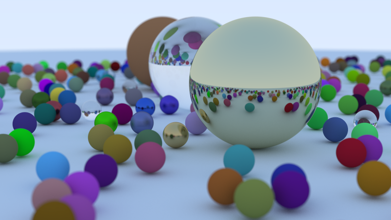

# Ray Tracing in One Weekend in Rust

[Ray Tracing in One Weekend](https://raytracing.github.io/books/RayTracingInOneWeekend.html)



```
RUSTFLAGS="-C target-cpu=native" cargo build --release
./target/release/raytracer
```
